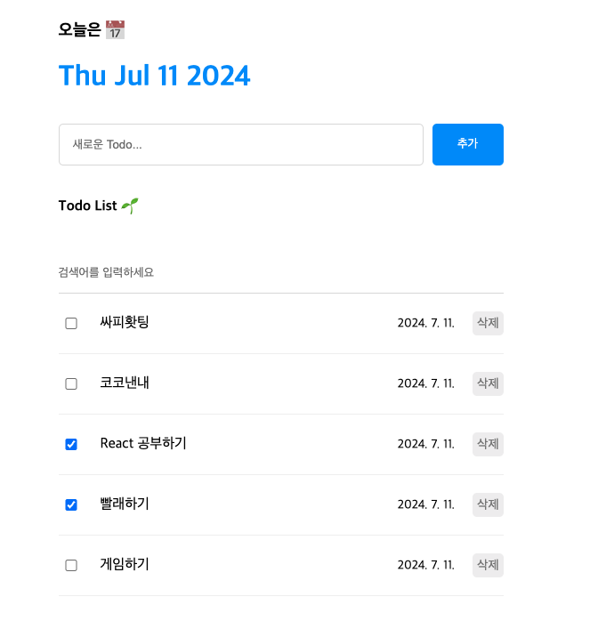

# 미니 프로젝트 08 _ Todo CRUD

목적 : Todo 목록을 CRUD 할 수 있는 프론트엔드 페이지 하나 구성  




## 구성도  

- App.jsx : 전체 컴포넌트들을 보여줌. Todo 리스트 목록이 담겨 있음  
- List.jsx : Todo List 목록들을 보여줌 - 검색어를 통해서 특정 단어가 담긴 것들만 보여줄 수 있음  
- Editor.jsx : 새로운 Todo 목록을 생성시켜주는 컴포넌트
- TodoList.jsx : List.jsx에서 Todo 목록 하나하나 컴포넌트 여기서 수정, 삭제가 이루어짐  

## CSS 디자인  

### App  
먼저 앱 단에서 flex, flex column방향으로 잡아놓고  
중앙에 배치하도록 하였음  
```css
.App {
  width: 500px;
  margin: 0 auto;
  display: flex;
  flex-direction: column;
  gap: 10px;
}

```

### List  
List 전체에서 flex flex-column을 적용하고  
여기서 TodoItem들을 보여주는 컴포넌트를 또 한번 flex-column을 적용  

```css
.List {
  display: flex;
  flex-direction: column;
  gap: 20px;
}

.List > input {
  width: 100%;
  border: none;
  border-bottom: 1px solid rgb(220, 220, 220);
  padding: 15px 0px;
}

.List > input:focus {
  outline: none;
  border-bottom: 1px solid rgb(37, 147, 255);
}

.List .todos_wrapper {
  display: flex;
  flex-direction: column;
  gap: 20px;
}


```

### Editor  
Editor는 flex - row 방향으로 잡음  
또한 Input에는 flex : 1 설정으로 가능한 최대 길이를 잡아놓게 함  

```css
.Editor {
  display: flex;
  gap: 10px;
}

.Editor > input {
  flex: 1;
  padding: 15px;
  border: 1px solid rgb(220, 220, 220);
  border-radius: 5px;
}

.Editor > button {
  cursor: pointer;
  width: 80px;
  border: none;
  background-color: rgb(37, 147, 255);
  border-radius: 5px;
  color: white;
}

```


### TodoItem 
Todo Item 각각에도 flex - row를 적용  
Content를 가능한 최대로 많이 먹도록 셋팅  
align-center를 적용하여 전부 세로축 기준 가운데로 정렬  

검색이나 삭제 할 때 주 사용법은 `filter` 기능을 이용하는 것

```css
.TodoItem {
  display: flex;
  align-items: center;
  gap: 20px;
  padding-bottom: 20px;
  border-bottom: 1px solid rgb(240, 240, 240);
}

.TodoItem input {
  width: 20px;
}

.TodoItem .content {
  flex: 1;
}

.TodoItem .date {
  font-size: 14px;
}

.TodoItem button {
  cursor: pointer;
  color: gray;
  font-size: 14px;
  border: none;
  border-radius: 5px;
  padding: 5px;
}

```

## 동작  
App.jsx에서는 기본값을 미리 만들어 놓음  
또한 결국 최상위 컴포넌트는 App.jsx이기에  
CRUD에 대한 모든 Function들을 전부 여기에 만들고  

각 함수당 사용이 필요한 컴포넌트에 `Props`로 전달  

```jsx
import "./App.css";
import { useState, useRef } from "react";
import Header from "./components/Header";
import Editor from "./components/Editor";
import List from "./components/List";

const mockData = [
  //dummy date - 리렌더링 된다해도 이건 별개 영역
  {
    id: 0,
    isDone: false,
    content: "React 공부하기",
    date: new Date().getTime(),
  },
  {
    id: 1,
    isDone: false,
    content: "빨래하기",
    date: new Date().getTime(),
  },
  {
    id: 2,
    isDone: false,
    content: "게임하기",
    date: new Date().getTime(),
  },
];

function App() {
  const [todos, setTodos] = useState(mockData);
  const idRef = useRef(3);
  const onCreate = (content) => {
    const newTodo = {
      id: idRef.current++,
      isDone: false,
      content,
      date: new Date().getTime(),
    };

    // 반드시 상태변화를 통해서만 됨... 따라서 Array push를 하는 방법은 다음과 같음
    setTodos((current) => [newTodo, ...current]);
  };

  const onUpdate = (targetId) => {
    // todos State값들 중 targetId와 일치하는 id 갖는 요소 데이터만 딱 바꾼 새로운 배열
    setTodos(
      todos.map((todo) => {
        return todo.id === targetId
          ? {
              ...todo,
              isDone: !todo.isDone,
            }
          : todo;
      })
    );
  };

  // 해당 타겟 아이디를 갖는 요소만 삭제하는 함수 - TodoItem 컴포넌트까지..
  const onDelete = (targetId) => {
    setTodos(
      todos.filter((todo) => {
        return todo.id !== targetId;
      })
    );
  };

  return (
    <div className="App">
      <Header />
      <Editor onCreate={onCreate} />
      <List todos={todos} onUpdate={onUpdate} onDelete={onDelete} />
      {/* List 안의 TodoItem에게 전달하는 것이 onUpdate */}
    </div>
  );
}

export default App;


```

### Editor  
해당 부분에 주 기능은 Create  
추가적으로 "Enter"를 하면 자동으로 등록되는 것  
그리고 빈 값인 경우 별도 처리 안하도록 설정하기  

```jsx
import { useState, useRef } from "react";
import "./Editor.css";
const Editor = ({ onCreate }) => {
  const [content, setContent] = useState("");
  const contentRef = useRef();

  const onChangeContent = (e) => {
    setContent(e.target.value);
  };

  const onSubmit = () => {
    if (content === "") {
      contentRef.current.focus(); // 빈 문자열이면 강제로
      return; // 빈 문자열이면 강제로 아무것도 안하기
    }
    onCreate(content);
    setContent(""); // 데이터 입력되면 초기화
  };

  const onKeyDown = (e) => {
    //Enter 키값 === 13
    if (e.keyCode === 13) onSubmit();
  };

  return (
    <div className="Editor">
      <input
        ref={contentRef}
        placeholder="새로운 Todo..."
        value={content}
        onChange={onChangeContent}
        onKeyDown={onKeyDown} // 키가 입력이 되면 발생하는 이벤트
      />
      <button onClick={onSubmit}>추가</button>
    </div>
  );
};

export default Editor;


```

### List  
핵심은 "검색기능"  
검색 기능헤서 단어가 하나라도 입력이 되면 그것들과 관련된 리스트들만 보여주고  
빈 값인 경우, 기존 저장된 모든 목록들을 보여주기  

```jsx
import "./List.css";
import TodoItem from "./TodoItem";
import { useState } from "react";
const List = ({ todos, onUpdate, onDelete }) => {
  const [search, setSearch] = useState(""); //검색어 전용

  const onChangeContent = (e) => {
    //검색어바 전용 이벤트 헨들러
    setSearch(e.target.value);
  };

  const getFilteredData = () => {
    //검색어 , 해당 검색어가 포함되는 content들의 todo 목록들만 리턴

    if (search === "") return todos; //빈문자열이면 Array 통째로 전달
    return todos.filter((todo) =>
      todo.content.toLowerCase().includes(search.toLowerCase())
    ); //includes() 해당 문자열 안에 검색어가 있는가?
    // 단 영어는 전부 소문자로 치환
  };

  const filteredTodos = getFilteredData(); //필터링된 배열

  return (
    <div className="List">
      <h4>Todo List 🌱</h4>
      <input
        type="text"
        placeholder="검색어를 입력하세요"
        onChange={onChangeContent}
        value={search}
      />
      <div className="todos_wrapper">
        {filteredTodos.map((todo) => {
          return (
            <div key={todo.id}>
              <TodoItem {...todo} onUpdate={onUpdate} onDelete={onDelete} />
            </div>
          );
        })}
      </div>
    </div>
  );
};

export default List;

```


### TodoItem

해당 부분의 핵심은 체크박스의 값 업데이트와 삭제 버튼 기능 구현  
각 데이터마다의 "고유한 키 값"을 이용해서 제거  

(고유한 키의 근원은 App에서의 useRef)

```jsx
import "./TodoItem.css";
const TodoItem = ({ id, isDone, content, date, onUpdate, onDelete }) => {
  const onChangeCheckbox = () => {
    //체크박스 업데이트
    onUpdate(id);
  };

  const onClickDeleteButton = (e) => {
    onDelete(id);
  };
  return (
    <div className="TodoItem">
      <input onChange={onChangeCheckbox} type="checkbox" checked={isDone} />
      <div className="content">{content}</div>
      <div className="date">{new Date(date).toLocaleDateString()}</div>
      <button onClick={onClickDeleteButton}>삭제 </button>
    </div>
  );
};

export default TodoItem;


```